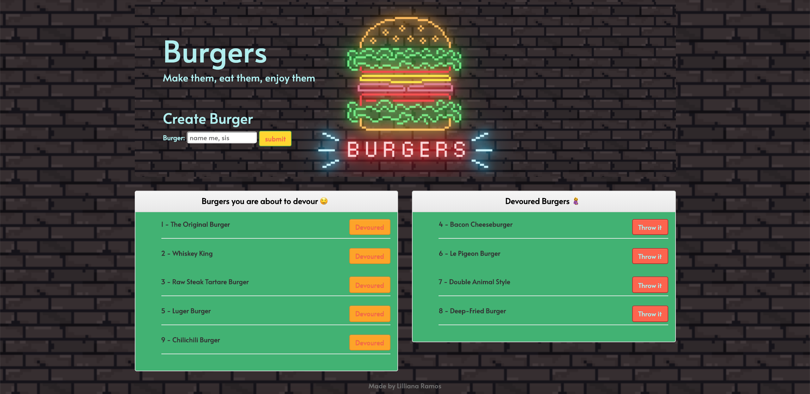

# Burger
Burger is a restaurant app where users input the names of burgers they will like to eat. Whenever a user submits a burger's name, it will be display on the left side of the page waiting to be devour 🤤. When the user clicks it, the burger will move to the right side of the page and you have the option to throw them away!🗑. The app will store every 🍔 in the database, whether is devoured or not.

Deployed app via heroku: 

(works on localhost:8080 if you follow instructions below)

## Technologies
* HTML 
* CSS
* Bootstrap
* Handlebars (Templating Engine)
* Javascript
* Nodejs
* Express
* mySQL
* DBeaver (GUI)

## Requirements
- Web Browser
- Nodejs
- Relational Database

## Installation
1. On GitHub, navigate to the main page of the repository.
2. Under the repository name, click Clone or download.
3. To clone the repository, click "Clone with HTTPS".
4. Open Terminal.
5. Change the current working directory to the location where you want the cloned directory to be made.
6. Type git clone, and then paste the URL you copied in Step 2.
7. Press Enter. Your local clone will be created. 
8. After installation, open node, navigate to the file and run `npm install`.
9. Please Ensure that You Have a Local Database Connected to the app.
